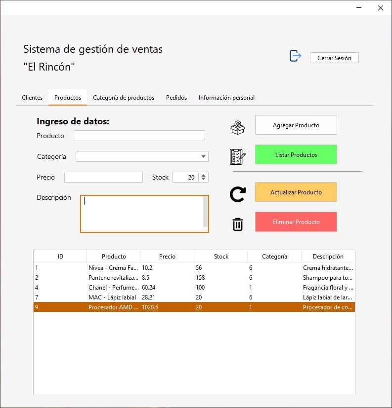

# Sistema de Gestión de Ventas

## Descripción

Este proyecto es una aplicación de escritorio desarrollada en Java que permite gestionar clientes, productos, categorías y pedidos de un negocio. La aplicación facilita el registro, actualización, eliminación y consulta de datos a través de una interfaz intuitiva.

## Capturas de pantalla





## Tecnologías Utilizadas

- **Java** (Swing para la interfaz gráfica)
- **SQL Server** (Base de datos para almacenamiento de información)
- **NetBeans** (Entorno de desarrollo utilizado)
- **JDBC** (Conexión con la base de datos)

## Características

- Autenticación de usuarios con validación de credenciales.
- Módulo de gestión de clientes (registro, modificación, eliminación y listado).
- Módulo de productos y categorías (agregar, editar, eliminar y listar).
- Módulo de pedidos con detalles asociados a cada venta.
- Conexión con base de datos SQL Server.
- Interfaz de usuario moderna con iconografía para mejorar la experiencia.

## Instalación y Uso

1. **Clonar el repositorio:**
   ```bash
   git clone <URL_DEL_REPOSITORIO>
   ```

2. **Abrir en NetBeans o cualquier IDE compatible con Java.**

3. **Configurar la base de datos en SQL Server:**
   - Importar el esquema de la base de datos desde el script proporcionado.
   - Configurar la conexión en `ConnectionSQLServer.java` con las credenciales correctas.

4. **Ejecutar el programa:**
   - Compilar y ejecutar `mainTest.java` o `VentanaPrincipal.java`.
   - Iniciar sesión y probar las funcionalidades.

## Estructura del Proyecto

```
SistemaGestionVentas/
│-- Assets/                # Recursos visuales como iconos
│-- Components/            # Clases de entidades principales
│   │-- Cliente.java
│   │-- Producto.java
│   │-- CategoriaProducto.java
│-- Controllers/           # Controladores y validadores
│   │-- ConnectionSQLServer.java
│   │-- Validators.java
│-- Models/                # Modelos de la base de datos
│   │-- modelCliente.java
│   │-- modelProducto.java
│-- Views/                 # Interfaces gráficas
│   │-- Login.java
│   │-- VentanaPrincipal.java
│-- README.md              # Documentación del proyecto
```

## Funcionamiento del Código

### `ConnectionSQLServer.java`

- Establece la conexión con la base de datos SQL Server.
- Maneja excepciones para evitar errores de conexión.

### `Login.java`

- Permite la autenticación de usuarios registrados.
- Valida las credenciales ingresadas.

### `VentanaPrincipal.java`

- Contiene la interfaz principal del sistema con pestañas para cada módulo.
- Permite la gestión de clientes, productos, pedidos y categorías.

## Mejoras Futuras

- Implementar reportes en PDF de ventas y clientes.
- Agregar soporte para múltiples usuarios con roles diferenciados.
- Integrar almacenamiento en la nube para acceso remoto.
- Mejorar la interfaz con JavaFX para un diseño más moderno.

## Contribución

Si deseas contribuir a este proyecto, puedes realizar un fork, mejorar el código y hacer un pull request.

## Conecta conmigo

<div align="center">
  <a href="https://www.linkedin.com/in/joaoH24/"></a>&nbsp;
  <a href="mailto:joao.huaman.f@gmail.com?subject=Hi Francis!"></a>&nbsp;
  <a href="#"></a>&nbsp;
  <a href="https://www.youtube.com/@CodigoGalleta"></a>&nbsp;
  <a href="https://github.com/JoaoH24"></a>&nbsp;
</div>


